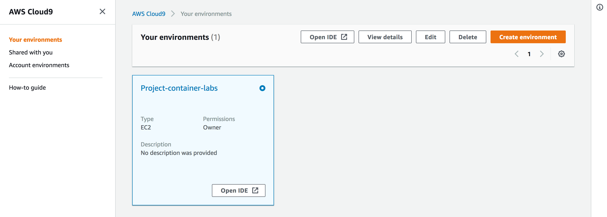
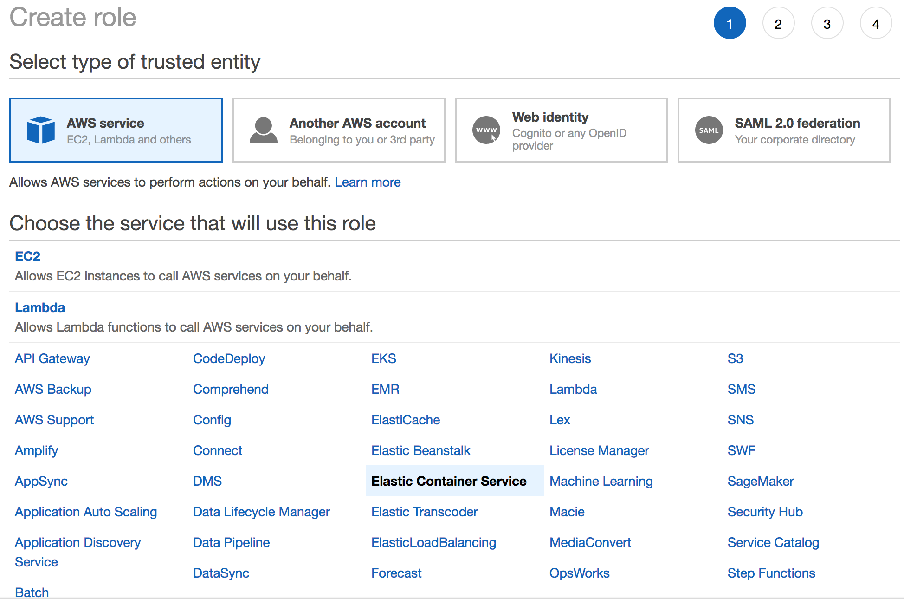
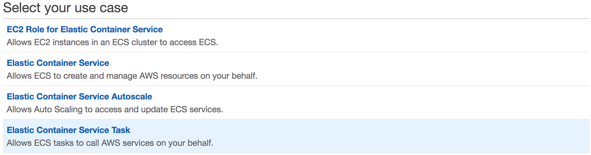
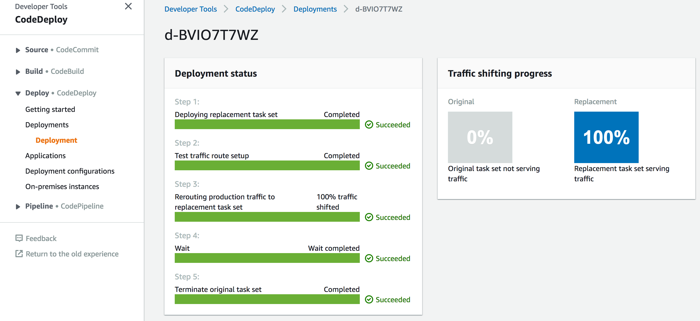

Monolith to Microservices with Docker and AWS Fargate
========================================================

Welcome to the Container Immersion Day Labs!

In this lab, you'll deploy a basic nodejs monolithic application using Auto Scaling & Application Load Balancer. In subsquent labs you would containerize this app using Docker and then use Amazon ECS to break this app in more manageable microservices. Let's get started!

### Requirements:

* AWS account - if you don't have one, it's easy and free to [create one](https://aws.amazon.com/).
* AWS IAM account with elevated privileges allowing you to interact with CloudFormation, IAM, EC2, ECS, ECR, ALB, VPC, CodeDeploy, CloudWatch, Cloud9. [Learn how](https://docs.aws.amazon.com/IAM/latest/UserGuide/id_users_create.html).
* Familiarity with [Docker](https://www.docker.com/), and [AWS](httpts://aws.amazon.com) - *not required but a bonus*.

### What you'll do:

* **Lab Setup:** [Setup working environment on AWS](#lets-begin)
* **Lab 1:** [Containerize the monolith](#lab-1---containerize-the-monolith)
* **Lab 2:** [Deploy the container using AWS Fargate](#lab-2---deploy-your-container-using-ecrecs)
* **Lab 3:** [Break the monolith into microservices](#lab-3---break-the-monolith-into-microservices)
* **Lab 4:** [CodeDeploy Blue/Green deployments](#lab-4-codedeploy-bluegreen-deployments)
* **Cleanup** [Put everything away nicely](#lab-cleanup)


### IMPORTANT: Lab Cleanup

You will be deploying infrastructure on AWS which will have an associated cost. When you're done with the lab, [follow the steps at the very end of the instructions](#lab-cleanup) to make sure everything is cleaned up and avoid unnecessary charges.


## Let's Begin!

### Lab Setup:

1. Open the CloudFormation launch template link below in a new tab. The link will load the CloudFormation Dashboard and start the stack creation process in the chosen region (us-east-1 recommended):
   
    Click on one of the **Deploy to AWS** icons below to region to stand up the core lab infrastructure.

| Region | Launch Template |
| ------------ | ------------- | 
**Oregon** (us-west-2) | [](https://console.aws.amazon.com/cloudformation/home?region=us-west-2#/stacks/new?stackName=container-labs&templateURL=https://s3-ap-southeast-2.amazonaws.com/aajolly-labs/core-setup.yml)  
**N.Virginia** (us-east-1) | [](https://console.aws.amazon.com/cloudformation/home?region=us-east-1#/stacks/new?stackName=container-labs&templateURL=https://s3-ap-southeast-2.amazonaws.com/aajolly-labs/core-setup.yml)  


2. The template will automatically bring you to the CloudFormation Dashboard and start the stack creation process in the specified region. Give the stack a name that is unique within your account, and proceed through the wizard to launch the stack. Leave all options at their default values, but make sure to check the box to allow CloudFormation to create IAM roles on your behalf:


See the *Events* tab for progress on the stack launch. You can also see details of any problems here if the launch fails. Proceed to the next step once the stack status advances to "CREATE_COMPLETE".

3. Access the AWS Cloud9 Environment created by CloudFormation:

On the AWS Console home page, type **Cloud9** into the service search bar and select it. Find the environment named like "Project-***STACK_NAME***":



When you open the IDE, you'll be presented with a welcome screen that looks like this:


On the left pane (Blue), any files downloaded to your environment will appear here in the file tree. In the middle (Red) pane, any documents you open will show up here. Test this out by double clicking on README.md in the left pane and edit the file by adding some arbitrary text. Then save it by clicking File and Save. Keyboard shortcuts will work as well. On the bottom, you will see a bash shell (Yellow). For the remainder of the lab, use this shell to enter all commands. You can also customize your Cloud9 environment by changing themes, moving panes around, etc. (if you like the dark theme, you can select it by clicking the gear icon in the upper right, then "Themes", and choosing the dark theme).

4. Clone the Container Immersion Day Repository:

In the bottom panel of your new Cloud9 IDE, you will see a terminal command line terminal open and ready to use.  Run the following git command in the terminal to clone the necessary code to complete this tutorial:

    ```
    $ git clone https://github.com/aajolly/container-immersion-day-15-05-2019.git
    ```

After cloning the repository, you'll see that your project explorer now includes the files cloned.

In the terminal, change directory to the subdirectory for this lab in the repo:

    ```
    $ cd container-immersion-day-15-05-2019/lab-1
    ```

5. Run some additional automated setup steps with the `setup` script:

    ```
    $ script/setup
    ```

This script will delete some unneeded Docker images to free up disk space, update aws-cli version and update some packages.  Make sure you see the "Success!" message when the script completes.


## About the monolith
### Basic Node.js Server

This is an example of a basic monolithic node.js service that has been designed to run directly on a server, without a container.

### Architecture

Since Node.js programs run a single threaded event loop it is necessary to use the node `cluster` functionality in order to get maximum usage out of a multi-core server.

In this example `cluster` is used to spawn one worker process per core, and the processes share a single port using round robin load balancing built into Node.js

We use an Application Load Balancer to round robin requests across multiple servers, providing horizontal scaling.


Get the ALB DNS name from cloudformation outputs stored in the file `cfn-output.json` and make sure the following calls work
    
    <pre>
    curl http://<<ALB_DNS_NAME>>
    curl http://<<ALB_DNS_NAME>>/api
    curl http://<<ALB_DNS_NAME>>/api/users | jq '.'
    </pre>

## Lab 1 - Containerize the monolith

The current infrastructure has always been running directly on EC2 VMs. Our first step will be to modernize how our code is packaged by containerizing the current Mythical Mysfits adoption platform, which we'll also refer to as the monolith application.  To do this, you will create a [Dockerfile](https://docs.docker.com/engine/reference/builder/), which is essentially a recipe for [Docker](https://aws.amazon.com/docker) to build a container image.  You'll use your [AWS Cloud9](https://aws.amazon.com/cloud9/) development environment to author the Dockerfile, build the container image, and run it to confirm it's able to process adoptions.

[Containers](https://aws.amazon.com/what-are-containers/) are a way to package software (e.g. web server, proxy, batch process worker) so that you can run your code and all of its dependencies in a resource isolated process. You might be thinking, "Wait, isn't that a virtual machine (VM)?" Containers virtualize the operating system, while VMs virtualize the hardware. Containers provide isolation, portability and repeatability, so your developers can easily spin up an environment and start building without the heavy lifting.  More importantly, containers ensure your code runs in the same way anywhere, so if it works on your laptop, it will also work in production.


1. Review the Dockerfile

2. Build the image using the [Docker build](https://docs.docker.com/engine/reference/commandline/build/) command.

This command needs to be run in the same directory where your Dockerfile is. **Note the trailing period** which tells the build command to look in the current directory for the Dockerfile.
    <pre>
    $ docker build -t api .
    </pre>

You now have a Docker image built. The -t flag names the resulting container image. List your docker images and you'll see the "api" image in the list. Here's a sample output, note the api image in the list:
    <pre>
    $ docker images
    REPOSITORY          TAG                 IMAGE ID            CREATED             SIZE
    api                 latest              6a7abc1cc4c3        7 minutes ago       67.6MB
    mhart/alpine-node   8                   135ddefd2040        3 weeks ago         66MB
    </pre>

**Note:** Your output will not be exactly like this, but it will be similar.

Notice the image is also tagged as "latest".  This is the default behavior if you do not specify a tag of your own, but you can use this as a freeform way to identify an image, e.g. api:1.2 or api:experimental.  This is very convenient for identifying your images and correlating an image with a branch/version of code as well.

3. Run the docker container and test the application running as a container:

Use the [docker run](https://docs.docker.com/engine/reference/run/) command to run your image; the -p flag is used to map the host listening port to the container listening port.
    <pre>
    $ docker run --name monolith-container -p 3000:3000 api
    </pre>


To test the basic functionality of the monolith service, query the service using a utility like [cURL](https://localhost:3000/api/threads), which is bundled with Cloud9.

Click on the plus sign next to your tabs and choose **New Terminal** or click **Window** -> **New Terminal** from the Cloud9 menu to open a new shell session to run the following curl command.
    <pre>
    $ curl http://localhost:3000/api/users
    </pre>

You should see a JSON array with data about threads.

Switch back to the original shell tab where you're running the monolith container to check the output from the monolith.

The monolith container runs in the foreground with stdout/stderr printing to the screen, so when the request is received, you should see a `GET`.

Here is sample output:
    <pre>
    GET /api/users - 3
    </pre>

In the tab you have the running container, type **Ctrl-C** to stop the running container.  Notice, the container ran in the foreground with stdout/stderr printing to the console.  In a production environment, you would run your containers in the background and configure some logging destination.  We'll worry about logging later, but you can try running the container in the background using the -d flag.
    <pre>
    $ docker run --name monolith-container -d -p 3000:3000 api
    </pre>

List running docker containers with the [docker ps](https://docs.docker.com/engine/reference/commandline/ps/) command to make sure the monolith is running.
    <pre>
    $ docker ps
    </pre>
    <pre>
    $ docker logs <b><i>CONTAINER_ID or CONTAINER_NAME</i></b>
    </pre>

Here's sample output from the above command:
    <pre>
    $ docker logs monolith-container
    Worker started
    Worker started
    GET /api/users - 3
    </pre>

4. Now that you have a working Docker image, you can tag and push the image to [Elastic Container Registry (ECR)](https://aws.amazon.com/ecr/).  ECR is a fully-managed Docker container registry that makes it easy to store, manage, and deploy Docker container images. In the next lab, we'll use ECS to pull your image from ECR.

Create an ECR repository using the [aws ecr cli](https://docs.aws.amazon.com/cli/latest/reference/ecr/index.html#cli-aws-ecr). You can use the hint below
    
    <details>
    <summary>HINT: Create ECR Repository for monolith service </summary>
    aws ecr create-repository --region us-east-1 --repository-name api
    </details>
    
Take a note of the repositoryUri from the output    
    
Retrieve the login command to use to authenticate your Docker client to your registry.
    
    <pre>
    $(aws ecr get-login --no-include-email --region us-east-1)
    </pre>
    
Tag and push your container image to the monolith repository.
    <pre>
    $ docker tag api:latest <b><i>ECR_REPOSITORY_URI</i></b>:latest
    $ docker push <b><i>ECR_REPOSITORY_URI</i></b>:latest
    </pre>

When you issue the push command, Docker pushes the layers up to ECR.

Here's sample output from these commands:
    <pre>
    $ docker tag api:latest <b>012345678912</b>.dkr.ecr.us-east-1.amazonaws.com/api:latest
    $ docker push <b>012345678912</b>.dkr.ecr.us-east-1.amazonaws.com/api:latest
    The push refers to a repository [<b>012345678912</b>.dkr.ecr.us-east-1.amazonaws.com/api:latest]
    0169d27ce6ae: Pushed 
    d06bcc55d2f3: Pushed 
    732a53541a3b: Pushed 
    721384ec99e5: Pushed 
    latest: digest: sha256:2d27533d5292b7fdf7d0e8d41d5aadbcec3cb6749b5def8b8ea6be716a7c8e17 size: 1158
    </pre>

View the latest image pushed and tagged in the ECR repository
    <pre>
    aws ecr describe-images --repository-name api                           
    {
    "imageDetails": [
        {
            "imageSizeInBytes": 22702204, 
            "imageDigest": "sha256:2d27533d5292b7fdf7d0e8d41d5aadbcec3cb6749b5def8b8ea6be716a7c8e17", 
            "imageTags": [
                "latest"
            ], 
            "registryId": "**012345678912**", 
            "repositoryName": "api", 
            "imagePushedAt": 1557648496.0
        }
        ]
    }
    </pre>

### Checkpoint:
At this point, you should have a working container for the monolith codebase stored in an ECR repository and ready to deploy with ECS in the next lab.

[*^ back to the top*](#monolith-to-microservices-with-docker-and-aws-fargate)

## Lab 2 - Deploy your container using ECR/ECS

Deploying individual containers is not difficult.  However, when you need to coordinate many container deployments, a container management tool like ECS can greatly simplify the task.

ECS refers to a JSON formatted template called a [Task Definition](http://docs.aws.amazon.com/AmazonECS/latest/developerguide/task_definitions.html) that describes one or more containers making up your application or service.  The task definition is the recipe that ECS uses to run your containers as a **task** on your EC2 instances or AWS Fargate.
    
    <details>
    <summary>INFO: What is a task? </summary>
    A task is a running set of containers on a single host. You may hear or see 'task' and 'container' used interchangeably. Often, we refer to tasks instead of containers because a task is the unit of work that ECS launches and manages on your cluster. A task can be a single container, or multiple containers that run together.
    </details>

Most task definition parameters map to options and arguments passed to the [docker run](https://docs.docker.com/engine/reference/run/) command which means you can describe configurations like which container image(s) you want to use, host:container port mappings, cpu and memory allocations, logging, and more.

In this lab, you will create a task definition to serve as a foundation for deploying the containerized adoption platform stored in ECR with ECS. You will be using the [Fargate](https://aws.amazon.com/fargate/) launch type, which let's you run containers without having to manage servers or other infrastructure. Fargate containers launch with a networking mode called [awsvpc](https://docs.aws.amazon.com/AmazonECS/latest/developerguide/task-networking.html), which gives ECS tasks the same networking properties of EC2 instances.  Tasks will essentially receive their own [elastic network interface](https://docs.aws.amazon.com/AWSEC2/latest/UserGuide/using-eni.html).  This offers benefits like task-specific security groups.  Let's get started!

*Note:** You will use the AWS CLI for this lab, but remember that you can accomplish the same thing using the AWS Console, SDKs, or CloudFormation.

### Instructions:

1. Create an ECS Cluster which will host all services

    <pre>
    aws ecs create-cluster --cluster-name "my_first_ecs_cluster" --region us-east-1
    </pre>

2. Create IAM roles for use with ECS

The 3 roles required are mentioned below
    
* [AWSServiceRoleForECS](https://docs.aws.amazon.com/AmazonECS/latest/developerguide/using-service-linked-roles.html): This is an IAM role which authorizes ECS to manage resources on your account on your behalf, such as updating your load balancer with the details of where your containers are, so that traffic can reach your containers. Use the command below to check if this role exists

    <pre>
    aws iam get-role --region us-east-1 --role-name AWSServiceRoleForECS
    </pre>
        
If it doesn't exist, you can create it using the following command
    <pre>
    aws iam create-service-linked-role --aws-service-name ecs.amazonaws.com
    </pre>
    
    
* [TaskRole](https://docs.aws.amazon.com/AmazonECS/latest/developerguide/task_IAM_role.html?shortFooter=true): This is a role which is used by the ECS tasks. Tasks in Amazon ECS define the containers that should be deployed togehter and the resources they require from a compute/memory perspective. So, the policies below will define the IAM permissions that your docker containers will have. If you write any code for the service that interactes with different AWS service APIs, these roles would need to include those as allowed actions. Create this role using the command line below:

    Create a file with name <user_name>_iam-trust-relationship.json that contains:
        <pre>
        {
	    "Version": "2012-10-17",
	    "Statement": [{
		    "Effect": "Allow",
		    "Principal": {
			    "Service": ["ec2.amazonaws.com", "ecs-tasks.amazonaws.com"]
		    },
		    "Action": "sts:AssumeRole"
	        }]
        }
        </pre>
    
    Create the IAM role:
        <pre>
        aws iam create-role --role-name ECSTaskRole --path "/service-role/" --assume-role-policy-document file://<user_name>_iam-trust-relationship.json
        </pre>
        
    Create the policy named <user_name>_ECSTaskRole-Policy.json
        <pre>
        {
	    "Version": "2012-10-17",
	    "Statement": [{
		    	"Effect": "Allow",
			    "Action": [
				    "ecr:GetAuthorizationToken",
				    "ecr:BatchCheckLayerAvailability",
				    "ecr:GetDownloadUrlForLayer",
				    "ecr:BatchGetImage"
			    ],
			    "Resource": "\*"
		    },
		    {
			    "Effect": "Allow",
			    "Action": [
				    "s3:CreateBucket",
				    "s3:GetBucketPolicy",
				    "s3:GetObject",
				    "s3:GetObjectAcl",
				    "s3:PutObject",
				    "s3:PutBucketPolicy"
			    ],
			    "Resource": "arn:aws:s3:\*:\*:\*"
		    },
		    {
			    "Effect": "Allow",
			    "Action": [
				    "logs:CreateLogGroup",
				    "logs:CreateLogStream",
				    "logs:PutLogEvents"
			    ],
			    "Resource": "arn:aws:logs:\*:\*:\*"
		    }
	        ]
        }
        </pre>
    
    Attach the policy with the role:
        <pre>
        aws iam put-role-policy --role-name ECSTaskRole --policy-name ECSTaskRole_Policy --policy-document file://<user_name>_ECSTaskRole-policy.json
        </pre>
        
    
* [ECSTaskExecutionRole](https://docs.aws.amazon.com/AmazonECS/latest/userguide/task_execution_IAM_role.html): The Amazon ECS container agent makes calls to the Amazon ECS API on your behalf, so it requires an IAM policy and role for the service to know that the agent belongs to you. It is more convenient to create this role using the console as there is a managed policy for this role.

    Create the role by selecting Elastic Container Service as the service and then selecting Elastic Container Service Task as the use case. For the permissions, search for *AmazonECSTaskExecutionRolePolicy*
    
    
    
    
    
3. Create an ECS task definition that describes what is needed to run the monolith.

Before you can run a task on your ECS cluster, you must register a task definition. [Task definitions](https://docs.aws.amazon.com/AmazonECS/latest/developerguide/task_definition_parameters.html?shortFooter=true) are lists of containers grouped together. Below is an example for our monolith app, name this fargate-task-def.json
    <pre>
    {
    "requiresCompatibilities": [
        "FARGATE"
    ],
    "containerDefinitions": [
        {
            "name": "monolith-cntr1",
            "image": "**012345678912**.dkr.ecr.us-east-1.amazonaws.com/api:latest",
            "memoryReservation": 128,
            "essential": true,
            "portMappings": [
                {
                    "containerPort": 3000,
                    "protocol": "tcp"
                }
            ],
            "logConfiguration": {
                "logDriver": "awslogs",
                "options": {
                    "awslogs-group": "/ecs/monolith-task-def",
                    "awslogs-region": "us-east-1",
                    "awslogs-stream-prefix": "ecs"
                }
            }
        }
    ],
    "volumes": [],
    "networkMode": "awsvpc",
    "memory": "512",
    "cpu": "256",
    "executionRoleArn": "arn:aws:iam::**012345678912**:role/ECSTaskExecutionRole",
    "taskRoleArn": "arn:aws:iam::**012345678912**:role/ECSTaskRole",
    "family": "monolith-task-def"
    }
    </pre>
    
**Note:** Replace the placeholder account number with your account number.

2. Check the CloudWatch logging settings in the container definition.

In the previous lab, you attached to the running container to get *stdout*, but no one should be doing that in production and it's good operational practice to implement a centralized logging solution.  ECS offers integration with [CloudWatch logs](https://docs.aws.amazon.com/AmazonCloudWatch/latest/logs/WhatIsCloudWatchLogs.html) through an awslogs driver that can be enabled in the container definition.

Take note of the log configuration i.e. in the logGroup = /ecs/monolith-task-def
Create a log group with the same name in cloudwatch logs, else your tasks would fail to start.
    <pre>
    aws logs create-log-group --log-group-name "/ecs/monolith-task-def"
    </pre>

3. Register the task definition using the task definition json file we created above.

    <pre>
    aws ecs register-task-definition --cli-input-json file://fargate-task-def.json
    </pre>
    
List task definitions using the below command
    <pre>
    aws ecs list-task-definitions
    </pre>

4. Create a new Target Group

        <pre>
        aws elbv2 create-target-group \
        --region us-east-1 \
        --name monolith-cntr-tg \
        --vpc-id <b>vpc-010b11d3ad023b4ed</b> \
        --port 3000 \
        --protocol HTTP \
        --target-type ip \
        --health-check-protocol HTTP \
        --health-check-path / \
        --health-check-interval-seconds 6 \
        --health-check-timeout-seconds 5 \
        --healthy-threshold-count 2 \
        --unhealthy-threshold-count 2 \
        --query "TargetGroups[0].TargetGroupArn" \
        --output text
        </pre>

**Note:** Replace the vpc-id with your specific id. You should be able to get the VPCId for your specific account from the cfn-output.json file. The output of the above command will provide the TargetGroup ARN, make a note of it.

Now lets modify the listener to point the load balancer to this new target group
    
        <pre>
        Get the listener-arn 
        
        aws elbv2 describe-listeners \
        --region us-east-1 \
        --query "Listeners[0].ListenerArn" \
        --load-balancer-arn arn:aws:elasticloadbalancing:us-east-1:<b>012345678912</b>:loadbalancer/app/alb-container-labs/86a05a2486126aa0/0e0cffc93cec3218 \
        --output text
        
        Modify the listener
            
        aws elbv2 modify-listener \
        --region us-east-1 \
        --listener-arn arn:aws:elasticloadbalancing:us-east-1:<b>012345678912</b>:listener/app/alb-container-labs/86a05a2486126aa0/0e0cffc93cec3218 \
        --query "Listeners[0].ListenerArn" \
        --default-actions Type=forward,TargetGroupArn=arn:aws:elasticloadbalancing:us-east-1:<b>012345678912</b>:targetgroup/monolith-cntr-tg/566b90ffcc10985e \
        --output text
        </pre>
    
    **Note:** Replace the placeholder arn's with your own arns. Make a note of the listener arn.

5. Create a new service now

Amazon ECS allows you to run and maintain a specified number of instances of a task definition simultaneously in an Amazon ECS cluster. This is called a service. If any of your tasks should fail or stop for any reason, the Amazon ECS service scheduler launches another instance of your task definition to replace it and maintain the desired count of tasks in the service depending on the scheduling strategy used.
Create a file named ecs-service.json with the following parameters

    <pre>
    {
        "cluster": "my_first_ecs_cluster", 
        "serviceName": "monolith-service", 
        "taskDefinition": "monolith-task-def:1", 
        "loadBalancers": [
            {
                "targetGroupArn": "arn:aws:elasticloadbalancing:us-east-1:**012345678912**:targetgroup/monolith-cntr-tg/566b90ffcc10985e", 
                "containerName": "monolith-cntr", 
                "containerPort": 3000
            }
        ], 
        "desiredCount": 2, 
        "clientToken": "", 
        "launchType": "FARGATE", 
        "networkConfiguration": {
            "awsvpcConfiguration": {
                "subnets": [
                    "**subnet-06437a4061211691a**","**subnet-0437c573c37bbd689**"
                ], 
                "securityGroups": [
                    "**sg-0f01c67f9a810f62a**"
                ], 
                "assignPublicIp": "DISABLED"
            }
        }, 
        "deploymentController": {
            "type": "ECS"
        }
    }
    </pre>

**Note:** Replace all placeholders for targetGroupArn, subnets & securityGroups with your account specific values for those parameters. You should be able to find these using the cfn-outputs.json file. The subnets used here are the private subnets.

Create service using the command below
    <pre>
    aws ecs create-service \
    --region us-east-1 \
    --cluster my_first_ecs_cluster \
    --service-name monolith-service \
    --cli-input-json file://ecs-service.json
    </pre>
    
Run the same curl command as before (or view the load balancer endpoint in your browser) and ensure that you get a response which says it runs on a container.

    <details>
    <summary>HINT: CURL Commands</summary>
        <pre>
        curl http://<<ALB_DNS_NAME>>
        curl http://<<ALB_DNS_NAME>>/api
        curl http://<<ALB_DNS_NAME>>/api/users | jq '.'
        </pre>
    </details>

### Checkpoint:
Nice work!  You've created a task definition and are able to deploy the monolith container using ECS.  You've also enabled logging to CloudWatch Logs, so you can verify your container works as expected.

[*^ back to the top*](#monolith-to-microservices-with-docker-and-aws-fargate)

## Lab 3 - Break the monolith into microservices

Take this lab as a challange where you break this monolith into microservices. Below is a quick reference architecture for microservices on ECS.


### Application Changes for Microsevices

__Define microservice boundaries:__ Defining the boundaries for services is specific to your application's design, but for this REST API one fairly clear approach to breaking it up is to make one service for each of the top level classes of objects that the API serves:

```
/api/users/* -> A service for all user related REST paths
/api/posts/* -> A service for all post related REST paths
/api/threads/* -> A service for all thread related REST paths
```

So each service will only serve one particular class of REST object, and nothing else.

### Instructions:

There are no instructions for this lab, however you can find the relevant resources in folder named lab-2

### Checkpoint:
Sweet! Now you have a load-balanced ECS service managing your containerized Mythical Mysfits application. It's still a single monolith container, but we'll work on breaking it down next.

[*^ back to the top*](#monolith-to-microservices-with-docker-and-aws-fargate)

## Lab 4: CodeDeploy Blue/Green deployments

In AWS CodeDeploy, blue/green deployments help you minimize downtime during application updates. They allow you to launch a new version of your application alongside the old version and test the new version before you reroute traffic to it. You can also monitor the deployment process and, if there is an issue, quickly roll back.

With this new capability, you can create a new service in AWS Fargate or Amazon ECS  that uses CodeDeploy to manage the deployments, testing, and traffic cutover for you. When you make updates to your service, CodeDeploy triggers a deployment. This deployment, in coordination with Amazon ECS, deploys the new version of your service to the green target group, updates the listeners on your load balancer to allow you to test this new version, and performs the cutover if the health checks pass.

**Note:** Although not necessary, however it is useful if you have completed lab-3 above i.e. breaking the monolith into microservices.

1. Setup an IAM service role for CodeDeploy

Because you will be using AWS CodeDeploy to handle the deployments of your application to Amazon ECS, AWS CodeDeploy needs permissions to call Amazon ECS APIs, modify your load balancers, invoke Lambda functions, and describe CloudWatch alarms. Before you create an Amazon ECS service that uses the blue/green deployment type, you must create the AWS CodeDeploy IAM role (ecsCodeDeployServiceRole).

* Create a file named CodeDeploy-iam-trust-policy.json

    <pre>
        {
        "Version": "2012-10-17",
        "Statement": [
            {
                "Sid": "",
                "Effect": "Allow",
                "Principal": {
                    "Service": [
                        "codedeploy.amazonaws.com"
                    ]
                },
                "Action": "sts:AssumeRole"
            }
        ]
    }
    </pre>

* Create the role with name ecsCodeDeployServiceRole

    <pre>
    aws iam create-role --role-name ecsCodeDeployServiceRole --assume-role-policy-document file://CodeDeploy-iam-trust-policy.json
    </pre>
    
* Since the compute platform we'll be working with is ECS, use the managed policy AWSCodeDeployRoleForECS

    <pre>
    aws iam attach-role-policy --role-name ecsCodeDeployServiceRole --policy-arn arn:aws:iam::aws:policy/service-role/AWSCodeDeployRoleForECS
    </pre>
    
2. Lets pick **threads** service for this lab.

Since the services we deployed in previous labs use ECS as the deployment controller, it is not possible to change this configuration using the update-service API call. Hence, we need to either a) delete the service or, b) create a new service with a different deployment controller i.e. CODE_DEPLOY. For this lab, we'll go with option a)

* Change the desired count for this service to 0

    <pre>
    aws ecs update-service \
    --region us-east-1 \
    --cluster my_first_ecs_cluster \
    --service threads \
    --desired-count 0
    </pre>
    
    **Note:** Wait for the running count to be 0
    
    <pre>
    aws ecs describe-services \
    --region us-east-1 \
    --cluster my_first_ecs_cluster \
    --service threads \
    --query "services[*].taskSets[*].runningCount"
    </pre>
    
* Delete the service once the runningCount = 0

    <pre>
    aws ecs delete-service \
    --region us-east-1 \
    --cluster my_first_ecs_cluster \
    --service threads
    </pre>

3. Lets update the db.json file for threads microservice and add another thread to it.
4. Once done, build a new docker image with a tag of 0.1. Tag & push this image to ECR repository of threads. By now, you should be familiar with this process.
5. Re-use the taskDefinition file for threads i.e. fargate-task-def-threads.json
6. Update the ecs-service-threads.json file to reflect CODE_DEPLOY as the deployment controller

    <pre>
    {
        "cluster": "my_first_ecs_cluster", 
        "serviceName": "threads", 
        "taskDefinition": "threads-task-def:1", 
        "loadBalancers": [
            {
                "targetGroupArn": "arn:aws:elasticloadbalancing:us-east-1:776055576349:targetgroup/threads-tg/b61b2b03ecb4c757", 
                "containerName": "threads-cntr", 
                "containerPort": 3000
            }
        ], 
        "desiredCount": 1, 
        "clientToken": "", 
        "launchType": "FARGATE",
        "schedulingStrategy": "REPLICA",
        "networkConfiguration": {
            "awsvpcConfiguration": {
                "subnets": [
                    "<b>subnet-06437a4061211691a</b>","<b>subnet-0437c573c37bbd689</b>"
                ], 
                "securityGroups": [
                    "<b>sg-0f01c67f9a810f62a</b>"
                ], 
                "assignPublicIp": "DISABLED"
            }
        }, 
        "deploymentController": {
            "type": "<b>CODE_DEPLOY</b>"
        }
    }
    </pre>

7. Re-create the **threads** service

    <pre>
    aws ecs create-service \
    --region us-east-1 \
    --cluster my_first_ecs_cluster \
    --service-name threads \
    --cli-input-json file://ecs-service-threads.json
    </pre>

8. Create a new target group & a listener for green environment

These will be referenced in the deployment-group you'd create for CodeDeploy.

* Target Group

    <pre>
    aws elbv2 create-target-group \
	--region us-east-1 \
	--name <b>threads-tg-2</b> \
	--vpc-id <b>VPCId</b> \
	--port 3000 \
	--protocol HTTP \
	--target-type ip \
	--health-check-protocol HTTP \
	--health-check-path / \
	--health-check-interval-seconds 6 \
	--health-check-timeout-seconds 5 \
	--healthy-threshold-count 2 \
	--unhealthy-threshold-count 2 \
	--query "TargetGroups[0].TargetGroupArn" \
	--output text
   </pre>

* Listener with a different port

    <pre>
    aws elbv2 create-listener \
    --region us-east-1 \
    --load-balancer-arn arn:aws:elasticloadbalancing:us-east-1:<b>012345678912</b>:loadbalancer/app/alb-container-labs/86a05a2486126aa0 \
    --port 8080 \
    --protocol HTTP \
    --default-actions Type=forward,TargetGroupArn=arn:aws:elasticloadbalancing:us-east-1:<b>012345678912</b>:targetgroup/threads-tg-2/b0ce12f4f6957bb7 \
    --query "Listener[0].Listener.Arn" \
    --output text
    </pre>

**Note:** Make note of the targetGroupArn & listenerArn

9. Create CodeDeploy resources

* Create the application which is a collection of deployment groups and revisions.

    <details>
    <summary>INFO: What is an Application? </summary>
    A name that uniquely identifies the application you want to deploy. CodeDeploy uses this name, which functions as a container, to ensure the correct combination of revision, deployment configuration, and deployment group are referenced during a deployment.
    </details>
    <pre>
    aws deploy create-application \
    --region us-east-1 \
    --application-name threadsApp \
    --compute-platform ECS
    </pre>

* Create an input json file for deployment-group named deployment-group-threads.json

    <details>
    <summary>INFO: What is a Deployment Group? </summary>
    From an Amazon ECS perspective, specifies the Amazon ECS service with the containerized application to deploy as a task set, a production and optional test listener used to serve traffic to the deployed application, when to reroute traffic and terminate the deployed application's original task set, and optional trigger, alarm, and rollback settings.
    </details>
    <pre>
        {
        "applicationName": "threadsApp", 
        "deploymentGroupName": "threadsDG", 
        "deploymentConfigName": "CodeDeployDefault.ECSAllAtOnce", 
        "serviceRoleArn": "arn:aws:iam::<b>012345678912</b>:role/ecsCodeDeployServiceRole",
        "ecsServices": [
            {
                "serviceName": "threads", 
                "clusterName": "my\_first\_ecs\_cluster"
            }
        ],
        "alarmConfiguration": {
            "enabled": false, 
            "ignorePollAlarmFailure": true, 
            "alarms": []
        }, 
        "autoRollbackConfiguration": {
            "enabled": true, 
            "events": [
                "DEPLOYMENT_FAILURE",
                "DEPLOYMENT\_STOP\_ON\_REQUEST",
                "DEPLOYMENT\_STOP\_ON\_ALARM"
            ]
        }, 
        "deploymentStyle": {
            "deploymentType": "BLUE_GREEN", 
            "deploymentOption": "WITH\_TRAFFIC\_CONTROL"
        }, 
        "blueGreenDeploymentConfiguration": {
            "terminateBlueInstancesOnDeploymentSuccess": {
                "action": "TERMINATE", 
                "terminationWaitTimeInMinutes": 5
            }, 
            "deploymentReadyOption": {
                "actionOnTimeout": "CONTINUE_DEPLOYMENT", 
                "waitTimeInMinutes": 0
            }
        }, 
        "loadBalancerInfo": {
            "targetGroupPairInfoList": [
                {
                    "targetGroups": [
                        {
                            "name": "<b>threads-tg</b>"
                        },
                        {
                            "name": "<b>threads-tg-2</b>"
                        }
                    ], 
                    "prodTrafficRoute": {
                        "listenerArns": [
                            "<b>arn:aws:elasticloadbalancing:us-east-1:<b>012345678912</b>:listener/app/alb-container-labs/86a05a2486126aa0/0e0cffc93cec3218</b>"
                        ]
                    }, 
                    "testTrafficRoute": {
                        "listenerArns": [
                            "<b>arn:aws:elasticloadbalancing:us-east-1:<b>012345678912</b>:listener/app/alb-container-labs/86a05a2486126aa0/d3336ca308561265</b>"
                        ]
                    }
                }
            ]
        }
    }
    </pre>
    
    <pre>
    aws deploy create-deployment-group \
    --region us-east-1 \
    --cli-input-json file://deployment-group-threads.json
    </pre>

* Creating a lifecycle hook for testing the new release. As discussed in the theory session, these are very helpful. The content in the 'hooks' section of the AppSpec file varies, depending on the compute platform for your deployment. The 'hooks' section for an EC2/On-Premises deployment contains mappings that link deployment lifecycle event hooks to one or more scripts. The 'hooks' section for an Amazon ECS deployment specifies Lambda validation functions to run during a deployment lifecycle event. If an event hook is not present, no operation is executed for that event. This section is required only if you are running scripts or Lambda validation functions as part of the deployment.
  So there are two parts to creating a hook, first an IAM role needs to be created which is used by lambda to pass back the testing results to CodeDeploy. You can either create the role using the CLI with the following policies
  - Managed Policy - AWSLambdaBasicExecutionRole for CloudWatch logs
  - And a new policy with the following permissions

    <pre>
        {
        "Version": "2012-10-17",
        "Statement": [
            {
                "Action": [
                    "codedeploy:PutLifecycleEventHookExecutionStatus"
                ],
                "Resource": "arn:aws:codedeploy:us-east-1:<b>012345678912</b>:deploymentgroup:*",
                "Effect": "Allow"
            }
        ]
    }
    </pre>
    
* Change directory to lab-3/hooks, do **npm install** and zip the contents.
* Create a lambda function

    <pre>
    aws lambda  create-function \
    --region us-east-1
    --function-name CodeDeployHook_pre-traffic-hook \
    --zip-file fileb://file-path/<b>file</b>.zip \
    --role <b>role-arn</b> \
    --environment Variables={TargetUrl=http://alb-container-labs-1439628024.us-east-1.elb.amazonaws.com:8080/api/threads} \
    --handler pre-traffic-hook.handler \
    --runtime nodejs8.10
    </pre>

**Note:** Feel free to review the configuration of the lambda function, its a simple check to verify the API works, however you can add other validation checks as well.

* Create an [AppSpec](https://docs.aws.amazon.com/codedeploy/latest/userguide/application-specification-files.html) file. It is used to manage each deployment as a series of lifecycle event hooks, which are defined in the file. For ECS as the compute platform, it can be either YAML or JSON formatted. For this lab, we'll use JSON.

    <pre>
    {
        "version": 0.0,
        "Resources": [
        {
        "TargetService": {
            "Type": "AWS::ECS::Service",
            "Properties": {
            "TaskDefinition": "threads-task-def:1",
            "LoadBalancerInfo": {
                "ContainerName": "threads-cntr",
                "ContainerPort": 3000
            },
            "PlatformVersion": "LATEST",
            "NetworkConfiguration": {
                "awsvpcConfiguration": {
                "subnets": [
                    "<b>subnet-06437a4061211691a</b>","<b>subnet-0437c573c37bbd689</b>"
                ],
                "securityGroups": [
                    "<b>sg-0f01c67f9a810f62a</b>"
                ],
                "assignPublicIp": "DISABLED"
                }
            }
            }
        }
        }
    ],
    "Hooks": [
        {
        "BeforeAllowTraffic": "CodeDeployHook_pre-traffic-hook"
        }
    ]
    }
    </pre>

* Start the deployment using the new aws ecs deloy CLI commands

    <pre>
    aws ecs deploy \
    --region us-east-1 \
    --cluster my\_first\_ecs\_cluster \
    --service threads \
    --task-definition fargate-task-def-threads.json \
    --codedeploy-appspec appspec.json \
    --codedeploy-application threadsApp \
    --codedeploy-deployment-group threadsDG
    </pre>

**Note:** The above will trigger a CodeDeploy Deployment, you can view the status of this deployment, at the end of it, it should look like 

If you now make some changes to the docker container threads, for example add another thread to db.json file and build a new container with a tag 0.1 + push to ECR. You can then create a revision of task definition and specifying the new image. During this process, selecting the existing CodeDeploy Application & Deployment-Group. This should trigger a new deployment in CodeDeploy and you can monitor the status in a similar way. Also feel free to check lambda logs in CloudWatch and add some of your own tests to this lambda.


### Checkpoint:
Congratulations, you've successfully deployed a service with blue/green deployments from CodeDeploy and with 0 downtime. If you have time, convert the other services to blue/green as well.  Otherwise, please remember to follow the steps below in the **Lab Cleanup** to make sure all assets created during the workshop are removed so you do not see unexpected charges after today.

## Lab Cleanup

This is really important because if you leave stuff running in your account, it will continue to generate charges.  Certain things were created by CloudFormation and certain things were created manually throughout the workshop.  Follow the steps below to make sure you clean up properly.

Delete manually created resources throughout the labs:

* ECS service(s) - first update the desired task count to be 0. Then delete the ECS service itself.
* Delete the ECS cluster as well
* ECR - delete any Docker images pushed to your ECR repository.
* CloudWatch log groups
* Delete the newly created Target groups for microservices
* Remove the project folder(container-immersion-day-15-05-2019) from cloud9 using the rm -vrf command
* Delete the cloudformation stack